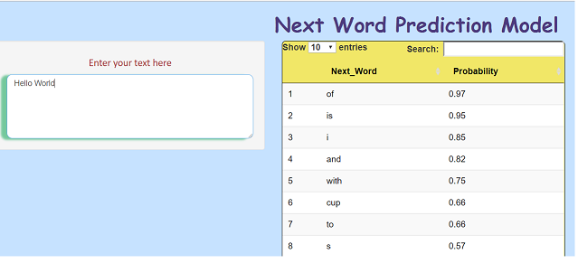

 Next Word Prediction 
========================================================

<b>Ramu Martha </b>  
Date: 2/21/2018

<b>Coursera Data Science Specialization Capstone Project</b>  
Capstone Project: SwiftKey Natural Language Processing  
 
Prediction App : https://ramumartha1.shinyapps.io/WordPredictionApp/   
Source Code :   https://github.com/ramumartha1/Capstone_Project

Overview
========================================================

Modern applications are looking for artistic ways to use data science to improve user interactions

This current Assignment is one of the important features of mobile and web applications where the user will have the option to select the *Next word predicted* by Text typing apps. This will add great value as it adding intelligent with natural language processing algorithm.

Beyond improving keystroke efficiency, literature points out other benefits of **word prediction** including the improvement of the quality and quantity of written work, enhancement in the development of written literacy skills, along with spelling assistance to people with various levels of spelling disorder

NWP is based on the analysis of a corpus (large text files) resulting in probability distributions over the different sequences of words occurring in the corpus. The resulting language model is then used for predicting the most likely next word.

Model Construction
========================================================
A Brief description of the steps are performed to generate the web App.
### Text DataBase Generation
- Step-1 : Generated text Text Corpus From the Coarsera Capstone assignment link. This test database consist of the Twitter Chats, News articles and Web blog discussion.
-   Step-2 : Using the quanteda, tm packages generated the Word tokens and n-grams. For this assignment I have considered the unigram, bigram,trigram and quadgrams. 
- Sorted the each grams with based on the frequency ( no of times it reoccurred in n-gram model)

 Smooth function steps
========================================================

- Using Katz back off Model generated the smoothing functions for the next prediction model. 

- If Input text consist of 3 words then this word sequence appeared in the quadgram, trigram and Bigram. Apply weightage of 0.5 for Quadgrams,  0.3 for trigram &  0.2Bigrams.

- If Input text consist of 2 words then this word sequence appeared in the trigram and Bigram. Apply weightage of 0.65 for trigram &  0. 35 Bigrams.

- If Input text consist of 1 words then this word sequence appeared in the Bigram. Apply weightage of 1 to all Bigrams.

- once we have calculated the Probability and weight smoothing factor we will sort the N-grams based on the highest probability.

 Shiny App Implementation
========================================================

- Next Word Prediction tool is developed using With Text Database, Prediction algorithm and Shiny inteface GUI/Reactive functions.  
-  This tool asked to enter the sequance of words. The Prediction tool will predict the Next word along with Probability. 
- Here Probability is measure of highly likely of Next word. 
- Here Next Word Prediction GUI image.

 Future Work Scope and Reference
========================================================
## Future Work Scope
- Spell checks & Spell Corrections
- Enhancement of the GUI with Word Insert chose words.
- Enhance the existing database

## Reference

- https://en.wikipedia.org/wiki/Exponential_backoff
- https://cs.stanford.edu/people/eroberts/courses/soco/projects/2004-05/nlp/techniques_word.html
- https://cran.r-project.org/web/packages/NLP/index.html

